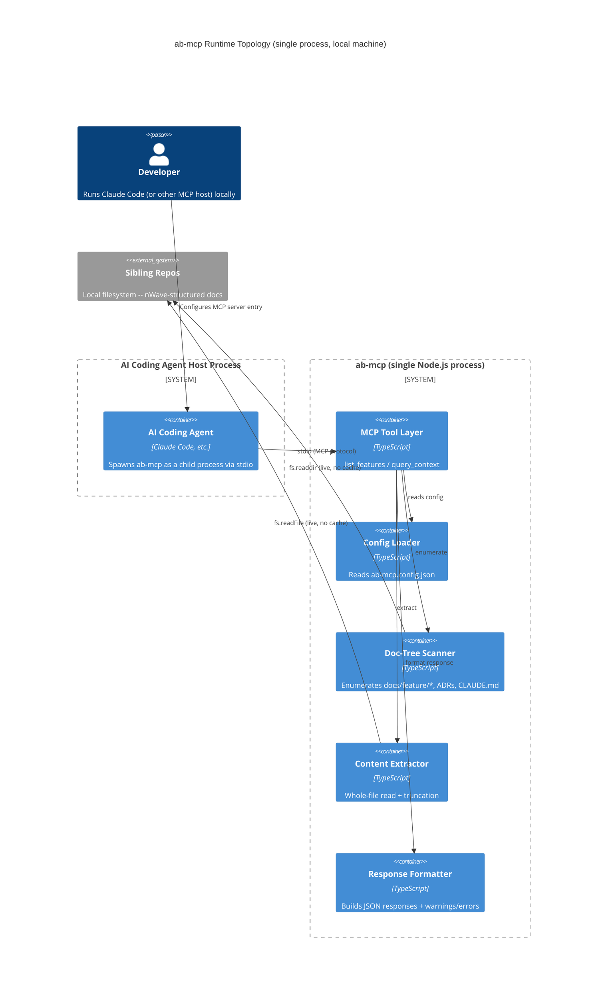

# Platform Architecture -- ab-mcp (DEVOPS)

## Context

ab-mcp is a **local, read-only MCP server** distributed as an npm package (ADR-001:
TypeScript + `@modelcontextprotocol/sdk`, npx-distributable). It speaks MCP over
**stdio** to a host AI coding agent (e.g., Claude Code) running on the same
machine. There is no server-side component, no cloud account, no database, and
no network listener -- "deployment" means **publishing a versioned npm package**
that users install/run locally (`npx ab-mcp` or as a local dependency).

This shapes every DEVOPS decision below: standard cloud/container/orchestration
concerns (Decisions 1-2, 6-7 of the nw-devops skill) collapse to "not applicable"
for this feature, confirmed with the stakeholder.

## Decisions (Confirmed by Stakeholder)

| Decision | Choice | Rationale |
|---|---|---|
| Deployment target | **npm package only** | No server/cloud component exists (per brief.md C4 diagrams -- single Node.js process, stdio transport). "Deploy" = `npm publish`. |
| Container orchestration | **None** | No long-running service to orchestrate. |
| CI/CD platform | **GitHub Actions** | Standard for OSS TS/npm projects, free for public repos, integrates cleanly with `npm publish`, `vitest`, `dependency-cruiser`. |
| Existing infrastructure | **None (greenfield)** | Confirmed in DESIGN wave-decisions.md -- no `src/`, no prior `docs/product/architecture/`. |
| Deployment strategy | **N/A (versioned release, "recreate"-equivalent)** | Each `npm publish` is an independent immutable version; users pin/upgrade via semver. No blue-green/canary/rolling concepts apply to a CLI/library artifact. |
| Continuous learning | **Not applicable** | Single-stakeholder OSS tool, no live monitoring/alerting infrastructure to build experimentation on top of. |
| Observability | **Structured stderr logs only** | See `observability-design.md`. |
| Git branching | **GitHub Flow** | See `branching-strategy.md`. |
| Mutation testing | **per-feature** | Persisted to root `CLAUDE.md` (see below). |

## Runtime Topology (carried from DESIGN brief.md C4 Container diagram)



No additional infrastructure containers are introduced by DEVOPS -- this diagram
is identical to DESIGN's, confirming no infrastructure-architecture drift.

## Installation/Distribution Model

- Published to npm registry as `ab-mcp` (package name TBD-confirm at publish time).
- Users add to their MCP host config (e.g., Claude Code `mcp_servers` config) as:
  ```json
  { "command": "npx", "args": ["-y", "ab-mcp"] }
  ```
- `bin` entry in `package.json` per ADR-001 / brief.md Section 7 Technology Stack.
- No install-time side effects beyond npm's normal package extraction (no
  post-install scripts, no global state, no daemons) -- keeps the
  `deployment_assumptions` in `environments.yaml` (idempotent, uninstall-safe)
  trivially true.
