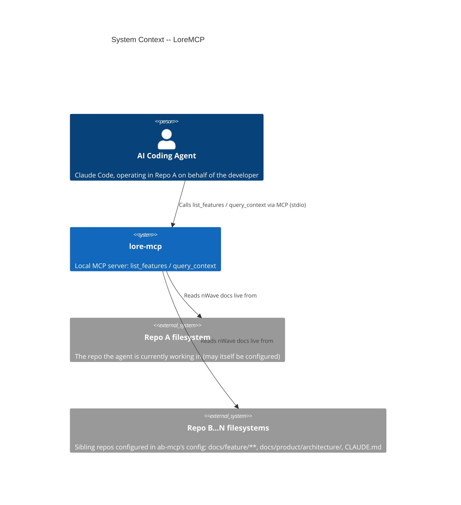
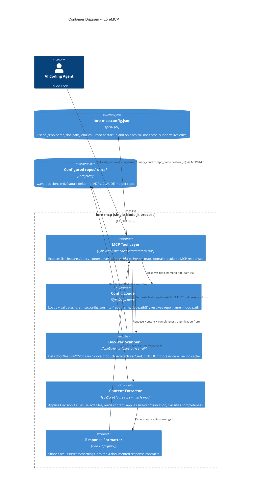

# Architecture Brief -- AB-MCP Product

## Application Architecture

> Authored by: solution-architect (Morgan), DESIGN wave
> Feature: ab-mcp (Cross-Repo Context Retrieval)
> Mode: Propose -- all 5 key decisions below, plus OQ-1 and OQ-2, were CONFIRMED by the stakeholder as proposed. CLAUDE.md paradigm note added (see repo root CLAUDE.md).
> Status of `docs/product/architecture/`: did not exist prior to this wave (greenfield product). This file establishes it.

---

### 1. System Context and Capabilities

LoreMCP is a **local, read-only MCP (Model Context Protocol) server** that gives an AI coding agent (e.g., Claude Code), operating in "Repo A", live read access to nWave-structured documentation (`wave-decisions.md`/`feature-delta.md`, ADRs under `docs/product/architecture/`, `CLAUDE.md`) in a configured list of sibling repos ("Repo B/C/D...").

Capabilities (from US-01..US-05 + US-CBQ-01..US-CBQ-04):
- `list_features(repo_name)` -- enumerate `docs/feature/*/` and phase subdirectories for a configured repo, plus `has_architecture_adrs`/`has_claude_md` flags.
- `query_context(repo_name, feature_id)` -- return live-read snippets from wave-decisions/feature-delta, ADRs, and/or CLAUDE.md, each with `source_file`, `phase`, `snippet`, plus `retrieved_at` and a `warnings` array for partial structure.
- `resolve_concern(concern)` -- keyword-search ALL configured repos for nWave artifacts (wave-decisions.md, feature-delta.md, ADRs, CLAUDE.md) mentioning the concern topic. Returns `matches` (with `repo_name`, `source_file`, `phase`, `snippet`, `relevance` tier), `rejected_paths` (rejection clauses near the concern keyword), and `warnings` (skipped repos, partial-structure notices). No `repo_name` parameter -- the whole point is the caller does not know which repo owns the concern.
- Structured errors only: `REPO_NOT_CONFIGURED`, `REPO_PATH_NOT_FOUND`, `FEATURE_NOT_FOUND`, `NO_NWAVE_STRUCTURE`, `CONCERN_NOT_FOUND`, `INVALID_CONCERN` -- never raw exceptions.

Out of scope (confirmed, do not build): ownership/boundary mapping, CLAUDE.md auto-injection, caching/invalidation, semantic/vector search.

---

### 2. Reuse Analysis

| Existing Component | Location | Reuse Potential | Disposition |
|---|---|---|---|
| -- (none found) | -- | N/A | No `src/` exists in this repo (confirmed via Glob `src/**` -> no results). `docs/product/architecture/` did not exist prior to this wave. This is a greenfield build -- the table is empty by design, not by omission. All components below are NEW with justification "no existing alternative." |

---

### 3. Constraints and Quality Attribute Priorities

- **Solo maintainer, OSS** -- maintainability and testability are paramount; avoid abstractions a single person can't keep coherent.
- **No CI yet** -- design must not assume CI-only enforcement; local pre-commit/test-suite enforcement preferred.
- **4-6 day total estimate across 5 stories** -- time-to-market matters; avoid speculative generality.
- **Local single process, no network, no DB** -- scalability/availability/fault-tolerance largely N/A. "Fault tolerance" = always returning a structured response (error or warning), never crashing or hanging.
- **Team structure (Conway's Law)**: single developer -- N/A, no team-boundary analysis needed.
- **KPI-4/KPI-5** (outcome-kpis.md) require thorough automated test coverage of error and warning paths -- this is the dominant testability driver and directly motivates the architecture pattern (Section 6).
- **External integrations**: NONE. Sibling repos are read-only filesystem inputs, not API integration partners (per story-map.md scope assessment). No contract testing required for this feature.

---

### 4. Key Decisions (Propose Mode -- Recommendations Pending Stakeholder Confirmation)

#### Decision 1 -- Language / MCP SDK

**RECOMMENDATION: TypeScript with `@modelcontextprotocol/sdk`**

| Option | Pros | Cons |
|---|---|---|
| **TypeScript + `@modelcontextprotocol/sdk`** (RECOMMENDED) | Official Anthropic SDK, first-class MCP support; distributable via `npx` (zero-install for Claude Code users -- matches how most community MCP servers are consumed); strong typing helps a solo maintainer avoid regressions in error/warning shape (KPI-4/5); large ecosystem for fs/markdown parsing (`gray-matter`, `fast-glob`) | Solo maintainer's familiarity with TS not confirmed but Claude Code/nWave tooling ecosystem is predominantly JS/TS-distributed |
| Python + `mcp` Python SDK | Official SDK also exists; good markdown/fs ecosystem | Distribution via `pip`/`uvx` is less ubiquitous for Claude Code MCP configs than `npx`; typing (mypy) is opt-in/weaker enforcement than TS by default |
| Node.js (plain JS, no TS) | Simplest setup, no build step | Loses compile-time contract enforcement for response shapes (error codes, warnings array) -- directly weakens KPI-4/5 testability goal |

**Rationale**: `npx`-based distribution is the dominant pattern for MCP servers consumed by Claude Code (lowest friction for the stakeholder and any future OSS users -- "add this entry to your MCP config" with zero global install). TypeScript's static types let us encode the 4 structured error shapes and the `warnings`/`results` response contracts as types, which the test suite (and `tsc`) enforce at compile time -- directly serving the maintainability/testability priority.

**ALTERNATIVES CONSIDERED**: Python `mcp` SDK (rejected: weaker default type enforcement, less common npx-equivalent distribution for this audience); plain JS (rejected: loses compile-time contract checking for the heavily-tested error/warning paths).

---

#### Decision 2 -- Development Paradigm

**RECOMMENDATION: Functional core, imperative shell** (functional-core/imperative-shell within idiomatic TypeScript -- not a separate paradigm choice from Decision 1, but how we structure TS code)

| Option | Pros | Cons |
|---|---|---|
| **Functional core / imperative shell** (RECOMMENDED) | The domain logic here is almost entirely pure transformations: parse config -> scan directory tree -> classify nWave structure -> extract snippet -> format response. Pure functions are trivial to unit test exhaustively (every error/warning combination becomes a table-driven test with no fs mocking needed for the core logic) -- directly serves KPI-4/KPI-5. Imperative shell (fs reads, MCP server wiring) stays thin and is the only part needing fs-probing/integration tests. | Requires discipline to keep fs calls out of the core; TS doesn't enforce purity natively (mitigated by lint rule / module boundary convention, see Section 7 enforcement) |
| OOP (classes per concern: ConfigLoader, DocScanner, SnippetExtractor, ResponseFormatter) | Familiar, fits ports-and-adapters textbook diagrams | Adds ceremony (class instantiation, DI wiring) for what are fundamentally stateless transformations; more code to maintain solo |

**Rationale**: Every core operation (classify a repo's nWave completeness level, build a `source_file` path, extract a snippet, shape a `warnings` array) is a pure function of inputs already read from disk. Pushing all fs/IO to a thin imperative shell (the MCP tool handlers) maximizes the proportion of code testable with zero mocking -- the highest-leverage move for a solo maintainer under KPI-4/5.

**ALTERNATIVES CONSIDERED**: OOP with DI (rejected: adds class/interface ceremony not justified by problem complexity -- 5 stories, ~4-6 days).

**Note on CLAUDE.md paradigm declaration**: Recommend adding a short "Development paradigm: functional core / imperative shell (pure functions for parsing/classification/formatting; IO isolated to adapter modules)" note to this repo's `CLAUDE.md` once this design is confirmed -- **ask stakeholder before writing**, do not do this automatically.

---

#### Decision 3 -- Config File Format

**RECOMMENDATION: JSON** (`lore-mcp.config.json`)

| Option | Pros | Cons |
|---|---|---|
| **JSON** (RECOMMENDED) | Zero extra dependency (native `JSON.parse`/`JSON.stringify` in Node); trivially validated with a TS type + lightweight runtime check (e.g., a small hand-written validator or `zod`); matches MCP server config conventions (Claude Code's own `mcp.json`/`.mcp.json` are JSON) -- stakeholder already edits JSON for MCP configs, zero new format to learn; list-of-objects shape (`[{repo-name, doc-path}, ...]`) is natural in JSON and trivially appendable (satisfies D-config/H4: append entry, no schema change) | No comments (mitigated: README documents config; or use JSONC if comments desired later) |
| YAML | Human-friendly, supports comments | Requires a YAML parser dependency (`yaml`/`js-yaml`); YAML's flexible typing (e.g., `yes`/`no`/`on`/`off` -> booleans) is a known footgun for path strings; inconsistent with the MCP-config-adjacent JSON convention the stakeholder already uses |
| TOML | Good for hand-edited config, less ambiguous than YAML | Extra dependency; less common in the JS/Node MCP ecosystem; no added benefit over JSON for a flat list-of-objects shape |

**Rationale**: The config shape is intentionally simple (flat list of 2-field objects) -- JSON's verbosity disadvantage (vs YAML) is negligible at this shape, and avoiding a parser dependency plus matching the existing MCP-config convention (JSON) reduces both code and cognitive load for the solo maintainer.

**ALTERNATIVES CONSIDERED**: YAML (rejected: extra dependency + type-coercion footguns for no shape benefit at this size); TOML (rejected: extra dependency, no ecosystem-fit advantage).

---

#### Decision 4 -- Markdown/Doc Parsing & "Relevant Snippet" Extraction Approach

**RECOMMENDATION: Whole-file return per matched source, with a structural cap (max-length truncation + heading-anchored truncation point if oversized)** -- i.e., return the full content of each matched file (`wave-decisions.md`/`feature-delta.md`, each matched ADR, `CLAUDE.md`) as the `snippet`, not a heading-extracted sub-section, UNLESS the file exceeds a size threshold, in which case truncate at the nearest preceding heading boundary and note truncation in `warnings`.

| Option | Pros | Cons |
|---|---|---|
| **Whole-file return (with size-cap truncation)** (RECOMMENDED) | Matches the actual examples throughout user-stories.md/journey yaml, where `snippet` shows substantial multi-line content (e.g., the full "Critical Reframe" section text). nWave `wave-decisions.md`/`feature-delta.md` files are ALREADY curated, small, and structured by convention (this is the entire premise of D-docquality) -- they don't need further extraction. Simplest possible implementation: read file, return content. Zero heading-parsing logic = zero parsing bugs = directly serves "simplest solution first" + testability (no markdown-AST library, no section-matching edge cases to test). | For ADRs/CLAUDE.md that could in principle be large, returning the whole file could be noisy -- mitigated by the size-cap + truncation-with-warning fallback (only engages for outlier files) |
| Heading-based section extraction (find a heading matching `feature_id` or topic, return that section) | Could reduce noise for large files | Requires a markdown parser + heading-matching heuristic (what if no heading matches `feature_id` literally? fuzzy matching?) -- this reintroduces exactly the "heuristic free-text indexing" that D-docquality REVISED explicitly rejected. Adds a new failure mode (SECTION_NOT_FOUND?) not in the agreed error taxonomy. Significantly more code to test for KPI-4/5. |
| Simple text search (grep for `feature_id` string, return surrounding lines) | Lightweight | Same heuristic-matching problem as above; brittle (feature_id as a literal string may not appear verbatim in prose); explicitly the kind of "ADR dump" heuristic indexing D-docquality REVISED scoped OUT |

**Rationale -- this is the crux of D-retrieval-risk**: "Relevant" is defined STRUCTURALLY, not semantically -- relevance comes entirely from the **path convention** (a file living at `docs/feature/{feature_id}/{phase}/wave-decisions.md` is *by construction* relevant to `feature_id`; an ADR at `docs/product/architecture/ADR-NNNN-*.md` is architecture-level context for ANY feature_id query when no feature-level doc exists). No content-based relevance scoring is performed. Within a structurally-relevant file, the WHOLE content is the snippet (these files are small/curated by nWave convention). The size-cap is a pragmatic safety valve, not a relevance mechanism -- if it triggers often in practice, that's a signal (per the D-retrieval-risk carry-forward note in discuss/wave-decisions.md) that warrants the flagged SPIKE on signaling mechanisms (frontmatter freshness tags, confidence scores), NOT a reason to add heuristic extraction now.

**Concrete extraction rules**:
1. For `query_context(repo_name, feature_id)`:
   - If `docs/feature/{feature_id}/` exists: for EACH phase subdirectory found (in directory order), look for `wave-decisions.md` then `feature-delta.md` (first match per phase); if found, add a result `{source_file, phase: <dirname>, snippet: <full file content, capped>}`.
   - ALWAYS additionally check `docs/product/architecture/*.md` (all ADR files, sorted by filename) -- each existing file becomes a result `{source_file, phase: "architecture", snippet: <full content, capped>}`. (Architecture-level context is repo-wide, not feature-scoped, so it's included alongside feature results when present, per US-04 Domain Example 1's intent of "best available context.") If `docs/feature/{feature_id}/` had at least one wave-decisions/feature-delta result, ADR results are still included but do NOT trigger the "no feature-level decisions" warning.
   - If NO `docs/feature/{feature_id}/wave-decisions.md`/`feature-delta.md` was found in ANY phase but ADRs exist: include ADR results + `warnings: ["No docs/feature/{feature_id}/.../wave-decisions.md or feature-delta.md found in '{repo_name}' -- returning architecture-level (ADR) context only. Feature-level decisions may not be captured."]`.
   - If NEITHER feature docs nor ADRs found, but `CLAUDE.md` exists at `doc_path`: include `{source_file: CLAUDE.md, phase: "repo-conventions", snippet: <full content, capped>}` + `warnings: ["Only CLAUDE.md-level context found in '{repo_name}' -- no feature-specific (docs/feature/{feature_id}/) or architecture-level (docs/product/architecture/) documentation exists."]`.
   - If NONE of the three exist anywhere relevant (no `docs/feature/{feature_id}/`, no `docs/product/architecture/`, no `CLAUDE.md`) AND the repo overall has none of the three artifact TYPES anywhere -> `NO_NWAVE_STRUCTURE`. (Note: if `docs/feature/{feature_id}/` itself doesn't exist but OTHER feature_ids do, AND no ADRs/CLAUDE.md -> `FEATURE_NOT_FOUND`, not `NO_NWAVE_STRUCTURE` -- see Decision 5 for the precedence rule.)
   - Truncation: if a file's content exceeds the size cap (recommend 8000 characters as a starting default, configurable constant), truncate at the last heading (`^#{1,6}\s`) boundary before the cap, append `\n\n...[truncated]`, and add a `warnings` entry: `"{source_file} truncated to {N} characters (heading-aligned); full content available at source_file."`.

**ALTERNATIVES CONSIDERED**: heading-based extraction and text-search-based extraction (both rejected as reintroducing heuristic indexing that D-docquality REVISED explicitly scoped out, and both expand the error/warning surface beyond the agreed taxonomy).

**UPDATE (heading-anchored-snippets feature, DESIGN wave)**: the above rejection of
heading-based extraction applied to `query_context`'s whole-file-return philosophy and
remains correct for that tool -- `query_context` still returns whole-file content per
Decision 4's path-convention-based relevance model. However, `resolve_concern` (added in
the `concern-based-querying` feature, after this Decision 4 text was written) inverted the
relevance model: the caller supplies a free-text concern, not a path, so the snippet for a
KEYWORD MATCH benefits from narrowing to the matched section once a multi-section file
produces noisy whole-file output in practice (observed via live dogfooding). This is
**not** a reversal of Decision 4 -- it is a `resolve_concern`-only refinement, layered on
top of ADR-005's keyword-matching strategy, governed by `adr-006-heading-boundary-parsing-strategy.md`.
`ConcernMatch.snippet` semantics are updated: previously "whole-file content, capped at
8000 chars, heading-aligned truncation"; now "the heading-anchored section containing the
highest-density match, capped at 8000 chars via the same existing truncation mechanism if
oversized -- OR whole-file content unchanged if the file has no markdown headings." See
Section 5.3 (updated) and `docs/feature/heading-anchored-snippets/design/architecture-design.md`.

---

#### Decision 5 -- Phase/Feature Discovery Mechanism

**RECOMMENDATION: Pure directory-listing enumeration, no hardcoded phase list, with a defined precedence order for the 4 structured outcomes**

| Option | Pros | Cons |
|---|---|---|
| **Directory enumeration (`fs.readdir`), phases derived from subdirectory names** (RECOMMENDED) | Matches Technical Notes in US-01 explicitly ("Phase enumeration should be derived from directory names... not hardcoded"); trivially correct for repos with only `discover/` (like ab-mcp itself today) and repos with all 4 phases; zero maintenance when nWave adds/renames phases | None significant for this scope |
| Hardcoded phase list (`["discover","discuss","design","deliver"]`), filter to existing dirs | Predictable ordering | Breaks if nWave renames/adds phases (e.g., a future "spike" phase) without an ab-mcp code change -- violates the spirit of "no schema changes to scale" |

**Rationale**: `list_features(repo_name)` is implemented as:
1. Validate `repo_name` against config -> `REPO_NOT_CONFIGURED` (with `available_repos`) if absent.
2. Validate `doc_path` exists on disk -> `REPO_PATH_NOT_FOUND` (with `configured_path`, `available_repos`) if absent.
3. Compute `has_architecture_adrs` = `docs/product/architecture/` exists AND contains >=1 `*.md` file.
4. Compute `has_claude_md` = `CLAUDE.md` exists at `doc_path`'s repo root (i.e., `doc_path/../CLAUDE.md` -- since `doc_path` is conventionally `<repo>/docs`, CLAUDE.md lives at `<repo>/CLAUDE.md`; CONFIRMED by stakeholder, see OQ-1 resolution below).
5. Enumerate `docs/feature/*/` subdirectories -> for each, enumerate its immediate subdirectories as `phases` (sorted alphabetically for determinism: `deliver, design, discover, discuss` -- agent doesn't need a "natural" phase order for this MVP since it's informational).
6. If steps 3-5 ALL yield nothing (zero feature dirs, no ADRs, no CLAUDE.md) -> `NO_NWAVE_STRUCTURE`.
7. Otherwise return `{repo_name, doc_path, features: [{feature_id, phases}], has_architecture_adrs, has_claude_md}`.

For `query_context`, the precedence for the 4 outcomes (`FEATURE_NOT_FOUND` vs `NO_NWAVE_STRUCTURE` vs partial-with-warnings vs full) is:
1. `REPO_NOT_CONFIGURED` / `REPO_PATH_NOT_FOUND` (config/fs-existence checks, same as `list_features`).
2. If repo has NONE of {any `docs/feature/*/`, `docs/product/architecture/*.md`, `CLAUDE.md`} -> `NO_NWAVE_STRUCTURE` (repo-wide condition, independent of requested `feature_id`).
3. Else if `docs/feature/{feature_id}/` does NOT exist AND repo has no ADRs and no CLAUDE.md to fall back to -> `FEATURE_NOT_FOUND` (with `available_features` = sibling directory names under `docs/feature/`).
4. Else if `docs/feature/{feature_id}/` does NOT exist BUT repo has ADRs and/or CLAUDE.md -> return those as partial results + warnings (per Decision 4 rules) -- NOT `FEATURE_NOT_FOUND`. *(This is a DESIGN clarification beyond the literal AC text -- CONFIRMED by stakeholder, see OQ-2 resolution below.)*
5. Else (feature dir exists) -> proceed per Decision 4 extraction rules.

**ALTERNATIVES CONSIDERED**: hardcoded phase list (rejected per US-01 Technical Notes, explicit).

**Open Questions -- RESOLVED by stakeholder**:
- OQ-1 (RESOLVED, CONFIRMED): `CLAUDE.md` location relative to `doc_path` is `<repo>/CLAUDE.md` (i.e., `path.join(doc_path, '..', 'CLAUDE.md')`, given `doc_path` = `<repo>/docs`). Matches all examples in user-stories.md.
- OQ-2 (RESOLVED, CONFIRMED): Step 4 above (feature_id directory absent, but repo has ADRs/CLAUDE.md -> partial result, not FEATURE_NOT_FOUND) is the binding precedence. This DESIGN-time interpretation of US-04's intent ("get the best available context AND know how complete it is") applies even when the feature directory itself is fully absent. Slice 02/Slice 03 test fixtures should reflect this: a repo with ADRs/CLAUDE.md but no `docs/feature/{feature_id}/` returns partial results + warnings, never `FEATURE_NOT_FOUND`.

---

### 5. C4 Diagrams

#### 5.1 System Context (L1)

#### 5.2 Container (L2)

#### 5.3 Component (L3) -- concern-based-querying addition

With `resolve_concern` added, the `src/core/` layer now has 3 modules and the `src/shell/` layer has 4 modules, crossing the threshold for an L3 diagram to show the new component and its relationships.

```mermaid
C4Component
  title Component Diagram -- LoreMCP (concern-based-querying addition)

  Person(agent, "AI Coding Agent", "Claude Code")

  Container_Boundary(shell, "src/shell/ (imperative shell -- IO only)") {
    Component(server, "server.ts", "TypeScript, @modelcontextprotocol/sdk", "Registers list_features / query_context / resolve_concern tools; orchestrates shell→core→shell→formatter pipeline; converts camelCase to snake_case for MCP JSON contract")
    Component(configloader, "config-loader.ts", "TypeScript, node:fs", "Loads and validates lore-mcp.config.json into RepoEntry[]; called fresh on every tool invocation (ADR-004)")
    Component(fsdoctreereader, "fs-doc-tree-reader.ts", "TypeScript, node:fs", "Implements DocTreeReader: probe / listDir / readFile / pathExists -- the ONLY module that imports node:fs")
  }

  Container_Boundary(core, "src/core/ (functional core -- pure functions, zero IO)") {
    Component(classifystructure, "classify-structure.ts", "TypeScript (pure)", "classifyStructure: given TreeSnapshot + feature_id, returns filesToRead + outcome + warnings. classifyRepoForListFeatures: returns feature list + flags. TreeSnapshot type shared with shell.")
    Component(formatresponse, "format-response.ts", "TypeScript (pure)", "Shapes all response and error types: QueryContextResponse, ListFeaturesResponse, ResolveConcernResponse, ConcernNotFoundError, InvalidConcernError, StructuredError union. Formatters: formatQueryContextResponse, formatListFeaturesResponse, formatResolveConcernResponse, formatInvalidConcern, formatConcernNotFound.")
    Component(concernmatcher, "concern-matcher.ts", "TypeScript (pure)", "validateConcern: checks non-empty + alphanumeric. matchConcernInSnapshot: case-insensitive keyword scan over pre-read file contents + feature directory names; returns ConcernMatch[] ranked by relevance tier + RejectedPath[]. detectRejectedPaths: paragraph-granularity rejection keyword detection. extractHeadingAnchoredSnippet (heading-anchored-snippets feature): narrows ConcernMatch.snippet to the heading-anchored section containing the highest-density match; returns null for headingless files, signaling fallback to whole-file truncation (ADR-006).")
  }

  ContainerDb(configfile, "lore-mcp.config.json", "JSON file", "List of {repo-name, doc-path} entries")
  ContainerDb(repodocs, "Configured repos' docs/", "Filesystem", "wave-decisions.md, ADRs, CLAUDE.md per repo")

  Rel(agent, server, "Calls resolve_concern(concern) / list_features(repo_name) / query_context(repo_name, feature_id) via MCP/stdio")
  Rel(server, configloader, "Loads config via")
  Rel(configloader, configfile, "Reads live from")
  Rel(server, fsdoctreereader, "Probes doc_path and reads files via")
  Rel(fsdoctreereader, repodocs, "Lists dirs and reads file content from")
  Rel(server, classifystructure, "Classifies tree snapshot for query_context and list_features via")
  Rel(server, concernmatcher, "Validates concern and matches content across all repos via")
  Rel(server, formatresponse, "Shapes all MCP responses via")
  Rel(concernmatcher, formatresponse, "ConcernMatch / RejectedPath types consumed by")
```

Note: `concern-matcher.ts` does NOT import `classify-structure.ts`. It derives the relevance tier directly from file path patterns (same rules, independent implementation) to avoid a cross-core coupling that would entangle two different classification concerns.

---

### 6. Architecture Pattern Recommendation

**RECOMMENDATION: Modular monolith (single Node.js process, single npm package), internally organized as a lightweight ports-and-adapters split between a functional core (config validation, structure classification, snippet extraction rules, response formatting -- ALL pure functions) and a thin imperative shell (fs reads, MCP SDK wiring).**

This is NOT "Hexagonal Architecture" as a heavyweight pattern with multiple adapter implementations -- there is exactly ONE adapter per port (real filesystem, real MCP transport), and no swapping is anticipated in production. The pattern is applied ONLY to the extent it serves testability:

- **Ports** (interfaces, minimal):
  - `ConfigSource` -- `loadConfig(): RepoEntry[]` (reads `lore-mcp.config.json`)
  - `DocTreeReader` -- `listDir(path): string[]`, `readFile(path): string`, `pathExists(path): boolean` (wraps `node:fs`)
  - `McpToolSurface` -- the two tool handlers registered with `@modelcontextprotocol/sdk`

- **Core (pure, no IO)**:
  - `classifyStructure(treeSnapshot, feature_id) -> { outcome, files-to-read, warnings }` -- implements Decision 4/5 precedence rules against an already-collected directory snapshot (so it's testable with plain in-memory fixtures, no real fs needed)
  - `formatResponse(...) -> JSON` -- shapes success/error/partial responses

- **Shell**:
  - Real `fs`-backed `DocTreeReader` adapter (the ONLY place `node:fs` is imported)
  - MCP server bootstrap registering `list_features`/`query_context`, calling shell -> core -> shell -> formatter

**Justification against quality attributes**:
- **Testability (KPI-4/5, dominant driver)**: `classifyStructure` and `formatResponse` are pure -- every error code, every warning combination, every truncation edge case becomes a fast unit test with in-memory fixtures (no temp directories, no fs mocking libraries). Only a small number of true integration tests are needed (real fs against fixture repo trees) to verify the `DocTreeReader` adapter and end-to-end wiring.
- **Maintainability**: 5 small modules, clear single responsibilities, no DI framework, no class hierarchies -- a solo maintainer can hold the whole system in their head.
- **Simplest-solution-first**: rejected alternatives below are both MORE complex without adding value at this scale.

**Rejected simpler/alternative architectures**:
1. **Single-file script (no module boundaries)** -- rejected: would still need the SAME logic (classification, extraction, formatting), but mixing fs calls into classification logic makes the error/warning matrix (the highest-test-volume area per KPI-4/5) require fs mocking for every test case, slowing the solo maintainer down. The marginal cost of 5 files over 1 is near-zero; the testability gain is large.
2. **Full hexagonal with repository-pattern classes + DI container** -- rejected: no second adapter is anticipated (always real fs, always real MCP stdio transport); a DI container adds a dependency and indirection with zero swap-benefit at this scale. Plain function imports suffice.
3. **Microservices / multi-process** -- rejected: explicitly N/A, single local process per System Constraints; team size (1) and lack of independent-deployment need fail every microservices trigger in the decision framework.

**Enforceable architecture rule (Principle 11)**: the "core has no IO" boundary is the one rule worth enforcing mechanically.
- **Recommended tooling**: [`dependency-cruiser`](https://github.com/sverweij/dependency-cruiser) (MIT license, active OSS, widely used in TS projects) with a rule forbidding `core/**` modules from importing `node:fs`, `node:path` (except pure `path` string ops if needed -- consider allowing `node:path` since it's pure, but forbid `node:fs`, `node:fs/promises`, `node:child_process`, `node:net`), or any module under `shell/**`. Run via `npx depcruise --validate` as a pre-commit hook (no CI yet, per constraints) and document in `package.json` scripts as `npm run check:arch`.
- This gives a fast, local, zero-CI-dependency enforcement mechanism appropriate for the solo-maintainer/no-CI-yet constraint.

---

### 7. Technology Stack

| Component | Choice | License | Rationale |
|---|---|---|---|
| Language | TypeScript 5.x | Apache 2.0 | Decision 1 |
| Runtime | Node.js (LTS, >=20) | MIT | Required by `@modelcontextprotocol/sdk`; `npx`-distributable |
| MCP SDK | `@modelcontextprotocol/sdk` | MIT | Official Anthropic SDK, actively maintained |
| Config format | JSON (`lore-mcp.config.json`) | N/A (no library; native `JSON.parse`) | Decision 3 |
| Config validation | Hand-written type guard, OR `zod` if validation complexity grows | MIT (zod) | Start with hand-written guard (zero deps); escalate to `zod` only if validation logic exceeds ~20 lines |
| Filesystem access | `node:fs/promises` (built-in) | N/A | No external dependency needed |
| Architecture boundary enforcement | `dependency-cruiser` | MIT | Section 6 |
| Test runner | `vitest` | MIT | Fast, native TS support, good for table-driven pure-function tests (core) + fixture-based integration tests (shell) |
| Packaging/distribution | npm package, `bin` entry for `npx ab-mcp` | MIT (project's own license, recommend MIT for OSS) | Matches MCP server distribution convention |

No proprietary technology anywhere in the stack.

---

### 8. Integration Patterns

- **Transport**: MCP over stdio (standard for local Claude Code MCP servers) -- `@modelcontextprotocol/sdk`'s `StdioServerTransport`.
- **Tool contracts** (informational -- exact JSON Schema is a software-crafter implementation detail, but the SHAPES below are binding per shared-artifacts-registry.md):
  - `list_features(repo_name: string)` -> `{repo_name, doc_path, features: [{feature_id, phases: string[]}], has_architecture_adrs: boolean, has_claude_md: boolean}` | or one of the structured error shapes
  - `query_context(repo_name: string, feature_id: string)` -> `{repo_name, feature_id, results: [{source_file, phase, snippet}], retrieved_at: string, warnings?: string[]}` | or one of the structured error shapes
  - `resolve_concern(concern: string)` -> `{concern, matches: [{repo_name, source_file, phase, snippet, relevance}], rejected_paths: [{repo_name, source_file, snippet, type}], warnings?: string[], retrieved_at: string}` | `CONCERN_NOT_FOUND` | `INVALID_CONCERN`
- **Error shapes** (all 6, SCREAMING_SNAKE_CASE `error` field):
  - `REPO_NOT_CONFIGURED`: `{error, repo_name, message, available_repos: string[]}`
  - `REPO_PATH_NOT_FOUND`: `{error, repo_name, configured_path, message, available_repos: string[]}`
  - `FEATURE_NOT_FOUND`: `{error, repo_name, feature_id, message, available_features: string[]}`
  - `NO_NWAVE_STRUCTURE`: `{error, repo_name, configured_path, message}`
  - `CONCERN_NOT_FOUND`: `{error, concern, message, searched_repos: string[], warnings?: string[], retrieved_at: string}` -- `searched_repos` lists only repos where the probe succeeded; skipped repos appear in `warnings`.
  - `INVALID_CONCERN`: `{error, concern, message, retrieved_at: string}` -- returned immediately (before any config load or fs access) for empty, whitespace-only, or non-alphanumeric concern strings.
- **No caching, no network, no DB** -- every call re-reads config + filesystem live (ADR-004).
- **External integrations**: NONE detected. Sibling repo filesystems are local read-only inputs, not API partners -- no contract testing required.

---

### 9. Earned Trust -- Probe Contracts for Filesystem Adapters (Principle 12)

ab-mcp's ONLY external dependency is the local filesystem (config file + sibling repos' `docs/` trees). The filesystem is the substrate that can "lie": permission-denied directories, symlinks pointing outside configured roots, case-insensitive filesystems (macOS default) causing path-matching surprises, very large files, files that are deleted/moved between the directory listing and the read (TOCTOU), and paths containing unusual characters.

Per Principle 12, the `DocTreeReader` adapter (the one shell module that touches `node:fs`) MUST specify a `probe()` contract:

- **`probe(doc_path: string): ProbeResult`** -- called by the composition root (server startup) for EACH configured `doc-path`, BEFORE the server announces tools as ready. NOT a one-time startup-only check for query-time paths -- `query_context`/`list_features` ALSO re-probe the SPECIFIC `doc_path` being accessed on each call (since "live, no cache" means paths can become invalid between calls -- this IS the US-03/US-05 requirement, reframed as a probe).

- **Fault-injection scenarios `probe()` must survive** (and map to defined outcomes, never raw exceptions):
  1. **Path does not exist** -> `REPO_PATH_NOT_FOUND` (US-03, already specified)
  2. **Path exists but is not a directory** (e.g., someone configured a file path) -> `REPO_PATH_NOT_FOUND` with a message clarifying "configured path is not a directory"
  3. **Path exists but is not readable** (permission denied) -> `REPO_PATH_NOT_FOUND` (per US-03 Scenario 4, explicitly mapped) -- probe via `fs.access(path, fs.constants.R_OK)` before attempting `readdir`
  4. **Path exists, readable, but a file disappears between `readdir` and `readFile`** (TOCTOU -- e.g., concurrent edit/delete by the developer) -> caught and treated as "file not found for this result" -- the result is OMITTED from `results[]` and a `warnings` entry added (`"{path} was listed but could not be read (may have been modified concurrently)"`) -- NEVER an unhandled rejection
  5. **Symlink escaping the configured `doc_path` root** -> followed and read normally for MVP (read-only, no write risk) but documented as a known non-goal for sandboxing; NOT a probe failure, just documented behavior
  6. **Case-insensitive filesystem (macOS/Windows) causing `docs/Feature/` vs `docs/feature/` ambiguity** -> probe scenario: directory listing comparison MUST be done via exact `readdir` results (not assumed-case path construction), so this is naturally handled IF the scanner always lists-then-matches rather than constructing-then-checking paths blindly. Documented as a probe scenario for the integration test suite (fixture with mixed-case directory name on a case-sensitive CI runner vs local macOS).

- **Composition-root invariant ("wire then probe then use")**: At startup, ab-mcp loads `lore-mcp.config.json`, then for EACH configured entry calls `probe(doc_path)`. If a probe fails for an entry, the server does NOT refuse to start entirely (unlike a typical "refuse to start" invariant) -- because a stale entry for repo X must not block querying repo Y (US-03's whole point is graceful per-repo degradation). Instead:
  - Startup logs a structured `health.startup.refused` event PER FAILING ENTRY (e.g., `{event: "health.startup.refused", repo_name, configured_path, reason: "REPO_PATH_NOT_FOUND"}`) to stderr (visible in Claude Code's MCP server logs) -- this is the adapted form of the "refuse to start" invariant for a multi-entry config: each entry is independently wired-then-probed, and a failing entry is marked degraded (subsequent queries against it return `REPO_PATH_NOT_FOUND` immediately without re-attempting fs access unnecessarily -- though since "no cache" applies, the PER-CALL probe in point 3 above is still the source of truth; the startup probe is purely an early-warning log, not a gate).
  - The server as a whole DOES start (both tools registered) as long as `lore-mcp.config.json` itself is valid JSON matching the expected shape -- if the config file itself is missing/malformed, THIS is a true `health.startup.refused` for the whole process (cannot serve any tool meaningfully), and the process exits non-zero with that structured event on stderr.

- **Three-layer enforcement of the probe contract**:
  1. **Subtype check (compile-time)**: `DocTreeReader` is defined as a TS `interface` (or branded type) with `probe`, `listDir`, `readFile`, `pathExists` methods. The composition root's wiring function has a parameter typed as `DocTreeReader` -- `tsc` rejects any adapter object missing `probe`.
  2. **Structural check (pre-commit/static)**: a small `dependency-cruiser` rule (or a custom AST grep via `ts-morph`, run as a pre-commit hook) verifies that the file implementing `DocTreeReader` (e.g., `src/shell/fs-doc-tree-reader.ts`) exports a function/object containing a `probe` property -- catches the case where someone satisfies the TS interface structurally via `as DocTreeReader` casting without actually implementing probe logic (a known TS structural-typing loophole).
  3. **Behavioral check (test suite, runs locally pre-commit and would run in CI once it exists)**: a gold-test file (`fs-doc-tree-reader.probe.test.ts`) exercises ALL 6 fault-injection scenarios above against a real temp directory (using `node:fs` + `node:os.tmpdir()`), asserting `probe()` and the read methods return the documented outcomes (never throw uncaught).
  - **Self-application**: a meta-test (`probe-contract.test.ts`) asserts that `fs-doc-tree-reader.probe.test.ts` exists and contains test cases for all 6 named scenarios (by name/string match on `it(...)` descriptions) -- ensuring the probe tests themselves aren't silently deleted or skipped over time.
  - `import-linter`-equivalent note: `import-linter` is Python-only and N/A here; `dependency-cruiser` is the chosen TS equivalent and DOES support the import-graph check (layer 2 partial) but, consistent with Principle 12(c), does NOT alone verify method-presence -- hence layers 1 and 3 are required in addition.

---

### 10. ADR Index

- `adr-001-language-and-mcp-sdk.md` -- TypeScript + `@modelcontextprotocol/sdk`
- `adr-002-config-file-format.md` -- JSON config format
- `adr-003-snippet-extraction-approach.md` -- whole-file-with-truncation extraction strategy
- `adr-004-no-caching-live-read.md` -- live filesystem reads, no caching layer
- `adr-005-concern-matching-strategy.md` -- keyword matching for resolve_concern (concern-based-querying feature)
- `adr-006-heading-boundary-parsing-strategy.md` -- regex-based heading-boundary parsing for snippet narrowing (heading-anchored-snippets feature)

---

### 11. Quality Gate Self-Check

- [x] Requirements traced to components (Section 4-6 map to US-01..US-05; concern-based-querying extension maps to US-CBQ-01..US-CBQ-04; heading-anchored-snippets maps to US-HAS-01 ACs 1-5 via `docs/feature/heading-anchored-snippets/design/architecture-design.md` Changes Per File table)
- [x] Component boundaries with clear responsibilities (Section 5.2, Section 5.3, Section 6)
- [x] Technology choices in ADRs with alternatives (Section 10, ADR files -- ADR-005, ADR-006 added)
- [x] Quality attributes addressed: maintainability/testability (Section 6), reliability via structured errors (Section 8), performance N/A documented (local fs reads, no perf NFR), security N/A (read-only, local, no auth surface)
- [x] Dependency-inversion compliance: core has zero IO imports, enforced via dependency-cruiser (Section 6, Section 9); `concern-matcher.ts` is pure by same rule, including new `extractHeadingAnchoredSnippet`
- [x] C4 diagrams: L1 + L2 in Mermaid (Section 5.1, 5.2); L3 updated for heading-anchored-snippets (Section 5.3, `concern-matcher.ts` component note extended -- no new component, no topology change)
- [x] Integration patterns specified (Section 8) -- `resolve_concern` contract unchanged in shape; `ConcernMatch.snippet` semantics updated (Decision 4 note)
- [x] OSS preference validated -- all choices MIT/Apache 2.0 (Section 7); no new dependencies added (ADR-006 explicitly rejects a markdown-AST library)
- [x] AC behavioral, not implementation-coupled (response-shape based, per Section 8 and architecture-design.md; US-HAS-01 ACs verified via snippet content, not internal parsing method)
- [x] External integrations: NONE -- explicitly stated, no contract-test annotation needed
- [x] Architectural enforcement tooling recommended: `dependency-cruiser` (Section 6, Section 9); no new rules required for `extractHeadingAnchoredSnippet` (existing `core/**` rule covers it)
- [x] Probe contracts specified for the sole external dependency (filesystem) -- Section 9; no new probe scenarios for heading-anchored-snippets (pure function over already-read content, no new substrate dependency)
